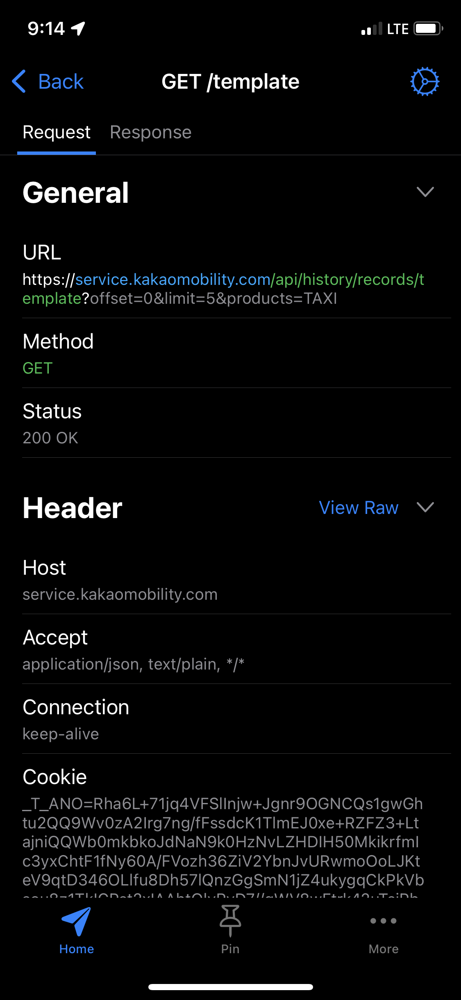
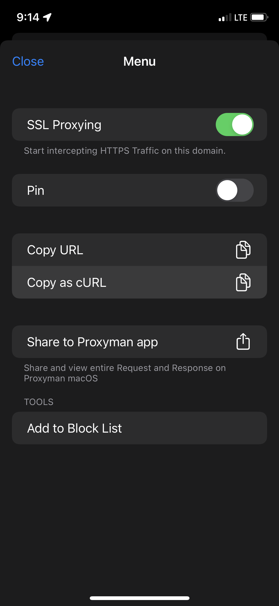

<h2>
귀차니즘 만렙인 저는<br />
입사 이례로 야근택시비 청구를<br />
계속 미뤄오고 있었는데요.
</h2>

> [🙋 뭐라고? 택시비 청구를 까먹을 정도로 **몰입해서 재미있게 일하는 회사가 있다고?**](https://www.alphaworks.team/)
>
> ~~※ 절대 홍보를 대가로 용서받기 위함이 아닙니다.~~

<h2>
그러길 6개월,<br />
모 코인이 푹석 떨어져서 📉📉📉<br />
제 재력에 한계가 오기 시작했어요...<br />
그래서 만들었습니다... ⭐
</h2>

<h1>
🚕<br />
카카오 T 앱의<br />
이용 기록을 토대로<br />
영수증을 한꺼번에 제출할 수 있도록 모아 줍니다.
</h1>

## Usage

### 1. 인증 정보 가져오기

Proxyman과 같은 앱을 사용해 SSL 프록시를 활성화한 뒤, 카카오 T 앱을 열고 이용 기록 화면으로 들어갑니다.

<!-- prettier-ignore -->
| 요청 상세 | cURL로 복사하기 |
| :-----: | :-----: |
|  |  |

`service.kakaomobility.com` 로 시작하는 요청 중 하나를 cURL 명령어로 복사합니다.

### 2. 코드 설정

먼저 본 저장소를 클론합니다.

```bash
# After starring this repo
git clone https://github.com/junhoyeo/taxi-receipts
cd taxi-receipts
```

`src` 폴더에 `curl.raw` 라는 이름의 파일을 만들고, 복사한 cURL 명령어를 붙여넣습니다.

```ts
// 회사에서 출발
const isSourceOffice = [].some((keyword) => source.includes(keyword));

// 집에서 출발
const isSourceHome = [].some((keyword) => source.includes(keyword));

// 집으로 도착
const isDestinationHome = [].some((keyword) =>
  destination.includes(keyword),
);

if (isSourceHome) {
  // 집에서 출발한 건 제외
  return [];
}
if (isSourceOffice && isDestinationHome) {
  // 회사에서 출발해서 집으로 온 것만
  console.log(source, '->', destination);
  return result;
} else if (source.includes('')) {
  // 예외
  return result;
}

// 나머지는 제외
return [];
```

`./src/index.ts` 파일에 회사와 집 위치에 공통적으로 들어갈 키워드를 넣어 설정해 줍니다.

### 4. 실행

```bash
yarn
yarn start
```

모든 준비가 완료되었다면, 스크립트를 실행합니다.
